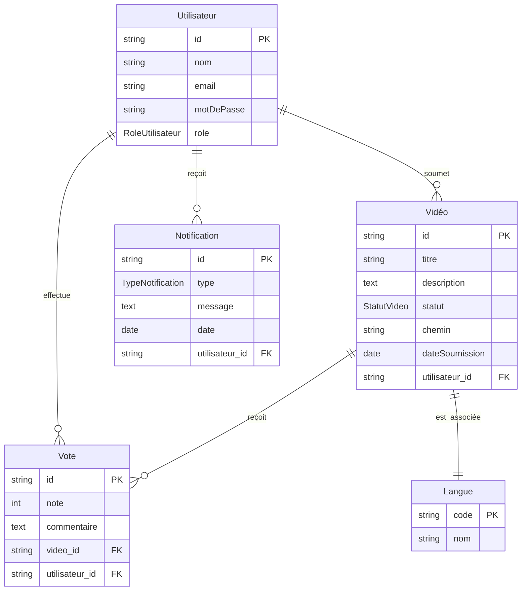

# Modèle Conceptuel de Données (MCD)

## Entités Principales

### Utilisateur
- **Identifiant** (id) : Clé primaire
- Nom : Chaîne de caractères
- Email : Chaîne de caractères unique
- Mot de passe : Chaîne de caractères
- Rôle : Enum (Utilisateur, Administrateur, Modérateur, Jury, PartenaireCommercial)

### Vidéo
- **Identifiant** (id) : Clé primaire
- Titre : Chaîne de caractères
- Description : Texte
- Statut : Enum (En attente, Approuvée, Rejetée)
- Chemin : Chaîne de caractères (URL ou chemin fichier)
- Date de soumission : Date
- Utilisateur_id : Clé étrangère vers Utilisateur

### Vote
- **Identifiant** (id) : Clé primaire
- Note : Entier (1 à 10)
- Commentaire : Texte
- Vidéo_id : Clé étrangère vers Vidéo
- Utilisateur_id : Clé étrangère vers Utilisateur

### Notification
- **Identifiant** (id) : Clé primaire
- Type : Enum (Validation de vidéo, Nouvelle vidéo, Mise à jour du classement)
- Message : Texte
- Date : Date
- Utilisateur_id : Clé étrangère vers Utilisateur

### Langue
- **Code** (id) : Clé primaire
- Nom : Chaîne de caractères

## Associations

1. **Un utilisateur peut soumettre plusieurs vidéos.**
   - Relation : 1,N entre Utilisateur et Vidéo

2. **Une vidéo peut recevoir plusieurs votes.**
   - Relation : 1,N entre Vidéo et Vote

3. **Un utilisateur peut voter pour plusieurs vidéos.**
   - Relation : 1,N entre Utilisateur et Vote

4. **Un utilisateur peut recevoir plusieurs notifications.**
   - Relation : 1,N entre Utilisateur et Notification

5. **Une vidéo est associée à une langue.**
   - Relation : 1,1 entre Vidéo et Langue

## Diagramme Conceptuel

