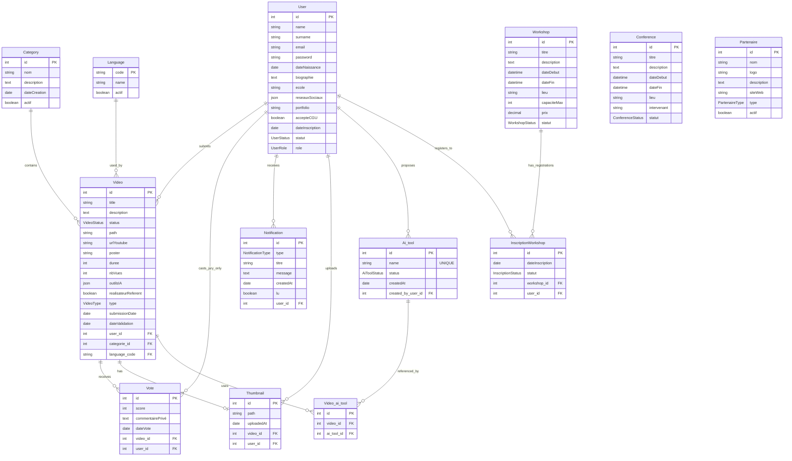

# Modèle Conceptuel de Données (MCD)

## Entités Principales

### Utilisateur
- **Identifiant** (`id`) : Clé primaire *(INT / BIGINT selon la BDD)*
- Nom : Chaîne de caractères
- Prénom : Chaîne de caractères
- Email : Chaîne de caractères unique
- Mot de passe : Chaîne de caractères
- **Date de naissance** : Date *(requis pour vérification âge)*
- **Biographie** : Texte
- **École** : Chaîne de caractères
- **Réseaux sociaux** : JSON *(liens vers profils sociaux)*
- **Portfolio** : Chaîne de caractères *(URL)*
- **Accepte CGU** : Booléen *(obligatoire)*
- **Date d'inscription** : Date
- **Statut** : Enum *(Actif, Inactif, Suspendu)*
- Rôle : Enum *(Utilisateur, Administrateur, Modérateur, Jury, PartenaireCommercial)*

---

### Film
- **Identifiant** (`id`) : Clé primaire *(UUID)*
- Titre : Chaîne de caractères
- Description : Texte
- Statut : Enum *(En attente, Approuvée, Rejetée, En modération)*
- Chemin : Chaîne de caractères *(URL ou chemin fichier)*
- URL YouTube : Chaîne de caractères *(pour contrôle des droits)*
- Durée : Entier *(en secondes, max 60)*
- Format : Chaîne de caractères *(ex: 16:9)*
- Sous-titres : Chaîne de caractères *(optionnel)*
- Date de soumission : Date
- user_id : Clé étrangère vers **User**
- created_at : Date
- updated_at : Date

---

### Miniature (Thumbnail)
> Une vidéo a **0 ou 1** miniature
- **Identifiant** (`id`) : Clé primaire *(INT / BIGINT)*
- Chemin : Chaîne de caractères *(URL ou chemin fichier)*
- Date d’upload : Date
- `video_id` : Clé étrangère vers **Vidéo** *(unique si 1 thumbnail max par vidéo)*
- `utilisateur_id` : Clé étrangère vers **Utilisateur** *(celui qui l’a upload)*

---

### Outil IA (AI Tool)
> Catalogue global (sans doublons).  
> Un utilisateur peut ajouter un nouvel outil IA : s’il n’existe pas, il est créé dans ce catalogue.
- **Identifiant** (`id`) : Clé primaire *(INT / BIGINT)*
- Nom : Chaîne de caractères *(unique)*
- Statut : Enum *(En attente, Approuvée, Rejetée)* *(option “pro” anti-spam)*
- Date de création : Date
- `created_by_user_id` : Clé étrangère vers **Utilisateur** *(qui a proposé l’outil IA)*

---

### Film ↔ AI_tools (liaison)
> Un film peut utiliser **0, 1 ou plusieurs** outils IA.  
> Un outil IA peut être utilisé par **plusieurs** films.
- film_id : Clé étrangère vers **Film**
- ai_tool_id : Clé étrangère vers **AI_tools**
- **Contrainte recommandée :** unicité sur (`film_id`, `ai_tool_id`) pour éviter les doublons

---

### Note
- id : Clé primaire *(UUID)*
- note : Entier *(1 à 10)*
- commentaire_privé : Texte *(visible uniquement par le jury et admin, non public)*
- created_at : Date
- film_id : Clé étrangère vers **Film**
- user_id : Clé étrangère vers **User** *(rôle JURY uniquement)*
- **Contrainte métier recommandée :** unicité sur (`user_id`, `film_id`)
- **Contrainte métier :** Seuls les utilisateurs avec le rôle JURY peuvent voter

---

### Notification
- id : Clé primaire *(UUID)*
- type : Enum *(VIDEO_VALIDATION, NEW_VIDEO, RANKING_UPDATE, WORKSHOP_REMINDER, GENERAL)*
- titre : Chaîne de caractères
- message : Texte
- date_creation : Date
- lu : Booléen *(défaut: false)*
- user_id : Clé étrangère vers **User**

---

### Langue
- **Code** (`code`) : Clé primaire *(ex: "fr", "en")*
- Nom : Chaîne de caractères *(ex: Français, Anglais)*
- **Actif** : Booléen *(langue active)*

---

### Workshop
- id : Clé primaire *(UUID)*
- nom : Chaîne de caractères
- description : Texte
- dateDebut : Date et heure
- dateFin : Date et heure
- created_at : Date

---

### Conférence
- **Identifiant** (`id`) : Clé primaire *(INT / BIGINT)*
- Titre : Chaîne de caractères
- Description : Texte
- Date de début : Date et heure
- Date de fin : Date et heure
- Lieu : Chaîne de caractères
- Intervenant : Chaîne de caractères
- Statut : Enum *(Programmée, En cours, Terminée, Annulée)*

---

### Partenaire
- **Identifiant** (`id`) : Clé primaire *(INT / BIGINT)*
- Nom : Chaîne de caractères
- Logo : Chaîne de caractères *(chemin)*
- Description : Texte
- Site web : Chaîne de caractères *(URL)*
- Type : Enum *(Sponsor Or, Sponsor Argent, Sponsor Bronze, Partenaire Média, Partenaire Technique)*
- Actif : Booléen

---

### Workshop_User (Table d'association)
- workshop_id : Clé étrangère vers **Workshop**
- user_id : Clé étrangère vers **User**
- dateInscription : Date

---

## Associations

1. **Un utilisateur peut soumettre plusieurs films.**
   - Relation : **1,N** entre **User** et **Film**
   - **Note :** Un utilisateur peut soumettre plusieurs films (suppression de la contrainte 1,1)

2. **Un film peut recevoir plusieurs notes.**
   - Relation : **1,N** entre **Film** et **Note**
   - **Contrainte :** Notes uniquement par les membres du jury (rôle JURY)

3. **Un utilisateur (jury) peut noter plusieurs films.**
   - Relation : **1,N** entre **User** et **Note**
   - **Contrainte :** Seuls les utilisateurs avec le rôle JURY peuvent noter

4. **Un utilisateur peut recevoir plusieurs notifications.**
   - Relation : **1,N** entre **User** et **Notification**

5. **Un film peut recevoir plusieurs commentaires.**
   - Relation : **1,N** entre **Film** et **Comment**
   - **Contrainte :** Les commentaires privés sont visibles uniquement par le jury/admin

6. **Un utilisateur peut écrire plusieurs commentaires.**
   - Relation : **1,N** entre **User** et **Comment**

7. **Un film peut utiliser 0..N outils IA, et un outil IA peut être utilisé par 0..N films.**
   - Relation : **N,N** entre **Film** et **AI_tools** via **Film_AItool**

8. **Un utilisateur peut avoir plusieurs rôles.**
   - Relation : **N,N** entre **User** et **Role** via **User_Role**

9. **Un utilisateur peut s'inscrire à plusieurs workshops.**
   - Relation : **N,N** entre **User** et **Workshop** via **Workshop_User**

10. **Un film peut appartenir à plusieurs playlists.**
    - Relation : **N,N** entre **Film** et **Playlist** via **Playlist_Film**

---

## Diagramme Conceptuel (Mermaid)

