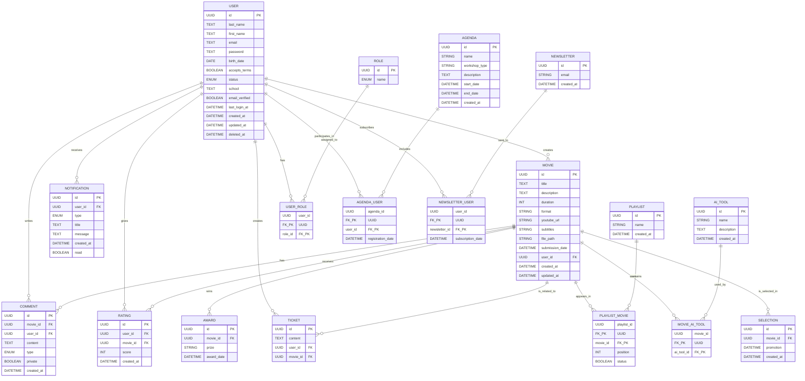

# Modèle Logique des Données (MLD)

## Tables et Attributs

### Table: User
- id (PK) : Identifiant unique (UUID, CHAR(36))
- nom : Nom (string)
- prenom : Prénom (string)
- email : Email unique (string)
- motDePasse : Mot de passe sécurisé (string, hashé)
- dateNaissance : Date de naissance (date)
- accepteCGU : Acceptation des CGU (boolean, NOT NULL, CHECK = 1)
- statut : Statut du compte (enum: ACTIVE, INACTIVE, SUSPENDED)
- created_at : Date de création (datetime)
- updated_at : Date de modification (datetime)
- deleted_at : Date de suppression (nullable)
- lastLoginAt : Dernière connexion (datetime, optionnel)
- emailVerified : Email vérifié (boolean, optionnel)

### Table: Role
- id (PK) : Identifiant du rôle (UUID, CHAR(36))
- nom : Nom du rôle (enum: VISITOR, ADMIN, COMITE, JURY, DIRECTOR)


### Table: Film
- id (PK) : Identifiant unique (UUID, CHAR(36))
- titre : Titre (string)
- description : Description (text)
- duree : Durée en secondes (int, CHECK <= 60)
- format : Format vidéo (string, CHECK = '16:9')
- urlYoutube : URL YouTube (string)
- fichier des sous-titres : URL ou texte des sous-titres (string, optionnel)
- chemin : Chemin ou URL du fichier (string)
- dateSoumission : Date de soumission (datetime)
- user_id (FK) : Réalisateur (UUID)
- candidature_id (FK, UNIQUE) : Référence à Candidature (UUID)
- created_at : Date de création (datetime)
- updated_at : Date de modification (datetime)

### Table: Comment
- id (PK) : Identifiant unique (UUID, CHAR(36))
- film_id (FK) : Référence à Film (UUID)
- user_id (FK) : Référence à User (UUID)
- contenu : Contenu du commentaire/annotation (text)
- commentaire : commentaire (enum: COMMENTAIRE, NOTE, TECHNIQUE, AUTRE)
- prive : Boolean (privé/public)
- created_at : Date de création (datetime)

### Table: Selection
- id (PK) : Identifiant unique (UUID, CHAR(36))
- film_id (FK) : Référence à Film (UUID)
- dateSelection : Date de sélection (datetime)
- type : Type de sélection (enum: OFFICIELLE, HORS_COMPETITION, AUTRE)

### Table: Laureat
- id (PK) : Identifiant unique (UUID, CHAR(36))
- film_id (FK) : Référence à Film (UUID)
- prix : Nom du prix (string)
- dateRemise : Date de remise (datetime)

### Table: Notification
- id (PK) : Identifiant unique (UUID, CHAR(36))
- user_id (FK) : Référence à User (UUID)
- type : Type de notification (enum: VIDEO_VALIDATION, NEW_VIDEO, RANKING_UPDATE, WORKSHOP_REMINDER, GENERAL)
- titre : Titre (string)
- message : Contenu (text)
- dateCreation : Date de création (datetime)
- lu : Notification lue (boolean, default: false)

### Table: Note
- id (PK) : Identifiant unique (UUID, CHAR(36))
- user_id (FK) : Référence à User (UUID)
- film_id (FK) : Référence à Film (UUID)
- note : Note (int, 1 à 10, NOT NULL)
- created_at : Date de création (datetime)

## Contraintes et Relations (SQL)
### Table: Playlist
- id (PK) : Identifiant unique (UUID, CHAR(36))
- nom : Nom (string)
- created_at : Date de création (datetime)

### Table: Workshop
- id (PK) : Identifiant unique (UUID, CHAR(36))
- nom : Nom (string)
- created_at : Date de création (datetime)

### Table: Agenda
- id (PK) : Identifiant unique (UUID, CHAR(36))
- nom : Nom (string)
- created_at : Date de création (datetime)

### Table: AI_tools
- id (PK) : Identifiant unique (UUID, CHAR(36))
- nom : Nom (string)
- created_at : Date de création (datetime)

### Table: Newsletter
- id (PK) : Identifiant unique (UUID, CHAR(36))
- email : Email (string)
- created_at : Date de création (datetime)

### Relations One-to-Many (1,N)
**Relations principales :**
- User (1) ──→ (N) Candidature : Un utilisateur peut déposer plusieurs candidatures
- User (1) ──→ (N) Film : Un utilisateur peut réaliser plusieurs films
- User (1) ──→ (N) Notification : Un utilisateur peut recevoir plusieurs notifications
- User (1) ──→ (N) Comment : Un utilisateur peut écrire plusieurs commentaires
- User (1) ──→ (N) Note : Un utilisateur peut donner plusieurs notes
- Film (1) ──→ (N) Comment : Un film peut recevoir plusieurs commentaires
- Film (1) ──→ (N) Note : Un film peut recevoir plusieurs notes
- Film (1) ──→ (N) Selection : Un film peut être sélectionné dans plusieurs catégories
- Film (1) ──→ (N) Laureat : Un film peut gagner plusieurs prix

### Relations One-to-One (1,1)
- Candidature (1) ──→ (1) Film : Une candidature correspond à un seul film (relation unique)
- Film (1) ──→ (1) Candidature : Un film correspond à une seule candidature

### Relations Many-to-Many (N,N)
**Tables d'association requises :**

| Relation | Table d'association | Clés étrangères | Description |
|----------|-------------------|-----------------|-------------|
| User ↔ Role | **User_Role** | user_id, role_id | Gestion des rôles utilisateur |
| User ↔ Workshop | **Workshop_User** | workshop_id, user_id | Inscriptions aux ateliers |
| User ↔ Newsletter | **Newsletter_User** | user_id, newsletter_id | Abonnements newsletter |
| Film ↔ Playlist | **Playlist_Film** | playlist_id, film_id | Organisation des films |
| Film ↔ AI_tools | **Film_AItool** | film_id, ai_tool_id | Outils IA utilisés |
| Workshop ↔ Agenda | **Agenda_Workshop** | agenda_id, workshop_id | Planification des ateliers |

### Contraintes supplémentaires
- **Newsletter** : Gestion via table d'association Newsletter_User
- **Notes** : Table dédiée Note avec contrainte CHECK (note BETWEEN 1 AND 10)
- **Agenda** : Relation via table d'association Agenda_Workshop pour flexibilité

### Résumé architectural

**Entités centrales :**
- **User** : Point central du système (candidatures, films, rôles, notifications)
- **Film** : Cœur métier avec relations vers sélections, prix, commentaires, notes
- **Tables d'association** : Toutes avec clé primaire composite (PK sur les 2 FK)

**Cardinalités principales :**
```
User (1,N) ←→ Film : Un utilisateur peut avoir plusieurs films
Film (1,1) ←→ Candidature : Relation unique et obligatoire
User (N,N) ←→ Role : Gestion fine des permissions
Film (N,N) ←→ Playlist : Organisation flexible du contenu
```

## Contraintes Métier et Techniques

- Acceptation CGU obligatoire pour User
- Durée Film ≤ 60 secondes
- Format vidéo 16:9 obligatoire
- Un commentaire privé n’est visible que par le jury/admin
- Un User de rôle JURY peut créer des commentaires privés (annotations techniques, notes)
## Diagramme Entité-Relation (ERD)

