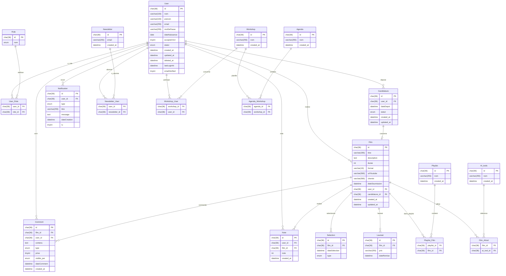

# Modèle Logique des Données (MLD)

## Tables et Attributs

### Table: User
- id (PK) : Identifiant unique (UUID, CHAR(36))
- nom : Nom (string)
- prenom : Prénom (string)
- email : Email unique (string)
- motDePasse : Mot de passe sécurisé (string, hashé)
- dateNaissance : Date de naissance (date)
- accepteCGU : Acceptation des CGU (boolean, NOT NULL, CHECK = 1)
- statut : Statut du compte (enum: ACTIVE, INACTIVE, SUSPENDED)
- created_at : Date de création (datetime)
- updated_at : Date de modification (datetime)
- deleted_at : Date de suppression (nullable)
- lastLoginAt : Dernière connexion (datetime, optionnel)
- emailVerified : Email vérifié (boolean, optionnel)

### Table: Role
- id (PK) : Identifiant du rôle (UUID, CHAR(36))
- nom : Nom du rôle (enum: VISITOR, ADMIN, COMITE, JURY, DIRECTOR)

### Table: Candidature
- id (PK) : Identifiant unique (UUID, CHAR(36))
- user_id (FK) : Référence à User (UUID)
- dateDepot : Date de dépôt (datetime)
- statut : Statut de la candidature (enum: EN_ATTENTE, ACCEPTEE, REFUSEE)
- created_at : Date de création (datetime)
- updated_at : Date de modification (datetime)

### Table: Film
- id (PK) : Identifiant unique (UUID, CHAR(36))
- titre : Titre (string)
- description : Description (text)
- duree : Durée en secondes (int, CHECK <= 60)
- format : Format vidéo (string, CHECK = '16:9')
- urlYoutube : URL YouTube (string)
- chemin : Chemin ou URL du fichier (string)
- dateSoumission : Date de soumission (datetime)
- user_id (FK) : Réalisateur (UUID)
- candidature_id (FK, UNIQUE) : Référence à Candidature (UUID)
- created_at : Date de création (datetime)
- updated_at : Date de modification (datetime)

### Table: Comment
- id (PK) : Identifiant unique (UUID, CHAR(36))
- film_id (FK) : Référence à Film (UUID)
- user_id (FK) : Référence à User (UUID)
- contenu : Contenu du commentaire/annotation (text)
- type : Type (enum: COMMENTAIRE, NOTE, TECHNIQUE, AUTRE)
- prive : Boolean (privé/public)
- visible_par : ENUM('ADMIN','JURY','AUTEUR')
- dateComment : Date du commentaire (datetime)
- created_at : Date de création (datetime)

### Table: Selection
- id (PK) : Identifiant unique (UUID, CHAR(36))
- film_id (FK) : Référence à Film (UUID)
- dateSelection : Date de sélection (datetime)
- type : Type de sélection (enum: OFFICIELLE, HORS_COMPETITION, AUTRE)

### Table: Laureat
- id (PK) : Identifiant unique (UUID, CHAR(36))
- film_id (FK) : Référence à Film (UUID)
- prix : Nom du prix (string)
- dateRemise : Date de remise (datetime)

### Table: Notification
- id (PK) : Identifiant unique (UUID, CHAR(36))
- user_id (FK) : Référence à User (UUID)
- type : Type de notification (enum: VIDEO_VALIDATION, NEW_VIDEO, RANKING_UPDATE, WORKSHOP_REMINDER, GENERAL)
- titre : Titre (string)
- message : Contenu (text)
- dateCreation : Date de création (datetime)
- lu : Notification lue (boolean, default: false)

### Table: Note
- id (PK) : Identifiant unique (UUID, CHAR(36))
- user_id (FK) : Référence à User (UUID)
- film_id (FK) : Référence à Film (UUID)
- note : Note (int, 1 à 10, NOT NULL)
- created_at : Date de création (datetime)

## Contraintes et Relations (SQL)
### Table: Playlist
- id (PK) : Identifiant unique (UUID, CHAR(36))
- nom : Nom (string)
- created_at : Date de création (datetime)

### Table: Workshop
- id (PK) : Identifiant unique (UUID, CHAR(36))
- nom : Nom (string)
- created_at : Date de création (datetime)

### Table: Agenda
- id (PK) : Identifiant unique (UUID, CHAR(36))
- nom : Nom (string)
- created_at : Date de création (datetime)

### Table: AI_tools
- id (PK) : Identifiant unique (UUID, CHAR(36))
- nom : Nom (string)
- created_at : Date de création (datetime)

### Table: Newsletter
- id (PK) : Identifiant unique (UUID, CHAR(36))
- email : Email (string)
- created_at : Date de création (datetime)

### Relations One-to-Many (1,N)
- Un User peut avoir plusieurs Candidatures :
	- User (1) ---< (N) Candidature (user_id)
- Un User peut soumettre plusieurs Films :
	- User (1) ---< (N) Film (user_id)
- Un User peut recevoir plusieurs Notifications :
	- User (1) ---< (N) Notification (user_id)
- Un Film peut recevoir plusieurs Comments :
	- Film (1) ---< (N) Comment (film_id)
- Un Film peut être sélectionné plusieurs fois :
	- Film (1) ---< (N) Selection (film_id)
- Un Film peut être lauréat de plusieurs prix :
	- Film (1) ---< (N) Laureat (film_id)
- Un Workshop peut avoir plusieurs Users inscrits (via table d'inscription, à ajouter si besoin)

### Relations One-to-One (1,1)
- Un Film peut être lié à une seule Playlist principale (si besoin, via clé étrangère playlist_id dans Film ou table d'association)

### Relations Many-to-Many (N,N)
- Un User peut avoir plusieurs Roles et un Role peut être attribué à plusieurs Users :
	- Table d'association User_Role (user_id, role_id)
- Un Film peut appartenir à plusieurs Playlists et une Playlist peut contenir plusieurs Films :
	- Table d'association Playlist_Film (playlist_id, film_id)
- Un User peut s'inscrire à plusieurs Workshops et un Workshop peut accueillir plusieurs Users :
	- Table d'association Workshop_User (workshop_id, user_id)
- Un Film peut utiliser plusieurs AI_tools et un AI_tool peut être utilisé dans plusieurs Films :
	- Table d'association Film_AItool (film_id, ai_tool_id)

### Autres tables et liens
- Newsletter :
	- Un User peut être abonné à la Newsletter (champ booléen dans User ou table d'association Newsletter_User)
- Notes :
	- Peut être géré via Annotation ou table Note (user_id, film_id, note, ...)
- Agenda :
	- Un Agenda peut contenir plusieurs Workshops/Events (Agenda (1) ---< (N) Workshop/Event)

**Résumé des liens principaux :**

- User (1) ---< (N) Candidature
- User (1) ---< (N) Film
- User (1) ---< (N) Notification
- User (N) ---< (N) Role (via User_Role)
- User (N) ---< (N) Workshop (via Workshop_User)
- User (1) ---< (N) Comment
- Film (1) ---< (N) Comment
- Film (1) ---< (N) Selection
- Film (1) ---< (N) Laureat
- Film (N) ---< (N) Playlist (via Playlist_Film)
- Film (N) ---< (N) AI_tools (via Film_AItool)
- Workshop (N) ---< (N) User (via Workshop_User)
- Workshop (N) ---< (N) Agenda (si besoin)

// Pour chaque table d'association, prévoir une clé primaire composite ou un id unique.

## Contraintes Métier et Techniques

- Acceptation CGU obligatoire pour User
- Durée Film ≤ 60 secondes
- Format vidéo 16:9 obligatoire
- Un commentaire privé n’est visible que par le jury/admin
- Un User de rôle JURY peut créer des commentaires privés (annotations techniques, notes)

## Diagramme de Conception (Mermaid)

** ce dossier a été généré par El miminette ! **