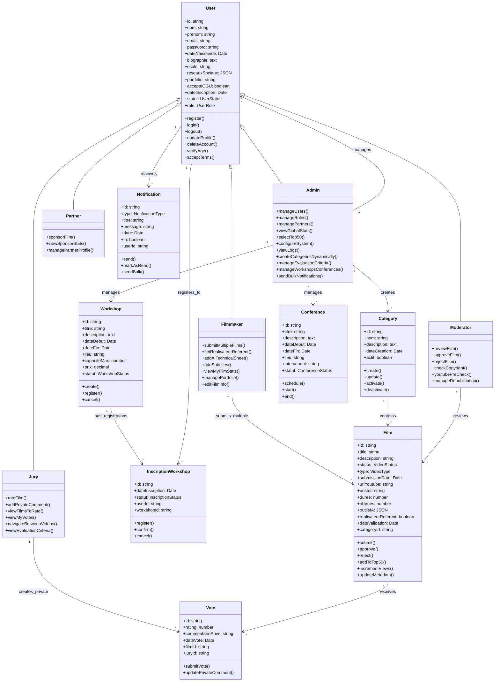

# Diagrammes UML - Festival Mars AI

## Diagramme de Classes des Acteurs

## Contraintes et Relations

### Relations principales :
- **Héritage** : Filmmaker, Jury, Moderator, Admin, Partner héritent de User
- **Composition** : Un Film peut avoir plusieurs Votes
- **Association** : Un Jury peut voter pour plusieurs Films
- **Dépendance** : Les Notifications dépendent des actions sur les Films

### Contraintes métier :
- **Seuls les Films avec statut APPROVED peuvent recevoir des votes**
- **Les Films doivent passer la modération avant publication**
- **Seuls les Jurys peuvent sélectionner le Top 50**
- **Les statistiques ne sont visibles qu'aux rôles autorisés**
- **Un réalisateur peut soumettre plusieurs films** (suppression contrainte 1,1)
- **Les commentaires de vote sont privés** (visibles uniquement par jury et admin)
- **L'acceptation des CGU est obligatoire** pour tous les utilisateurs
- **La date de naissance est requise** pour vérification d'âge
- **Seuls les utilisateurs avec rôle JURY peuvent voter**
- **Les catégories sont créées dynamiquement par l'admin**
- **Format vidéo : 16:9 horizontal, durée max 60 secondes**
- **Contrôle YouTube préalable obligatoire** pour vérification droits
