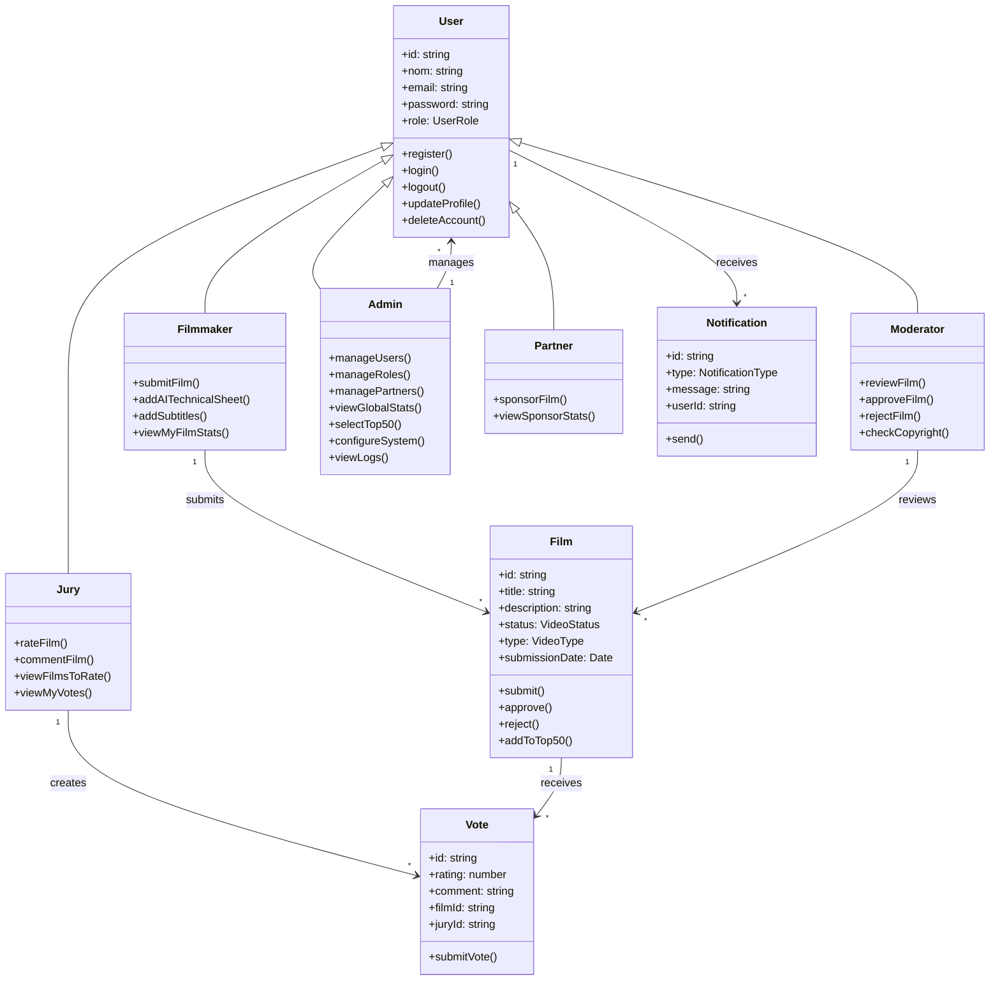

# Diagrammes UML - Festival Mars AI

## Diagramme de Classes des Acteurs

## Contraintes et Relations

### Relations principales :
- **Héritage** : Filmmaker, Jury, Moderator, Admin, Partner héritent de User
- **Composition** : Un Film peut avoir plusieurs Votes
- **Association** : Un Jury peut voter pour plusieurs Films
- **Dépendance** : Les Notifications dépendent des actions sur les Films

### Contraintes métier :
- Un Jury ne peut voter qu'une fois par Film
- Seuls les Films avec statut APPROVED peuvent recevoir des votes
- Les Films doivent passer la modération avant publication
- Seuls les Admins peuvent sélectionner le Top 50
- Les statistiques ne sont visibles qu'aux rôles autorisés
