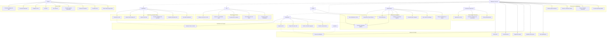

# Diagramme de Cas d'Usage Principal

```mermaid
graph TB
    %% Acteurs principaux
    Visiteur[Visiteur]
    Utilisateur[Utilisateur Connecté]
    Director[Réalisateur]
    Jury[Jury]
    Comite[Comité]
    Moderateur[Modérateur]
    Admin[Administrateur]
    Partner[Partenaire Commercial]
    Systeme[Système]

    %% Relations d'héritage entre acteurs
    Utilisateur -.-> Director
    Utilisateur -.-> Jury
    Utilisateur -.-> Comite
    Utilisateur -.-> Moderateur
    Utilisateur -.-> Admin
    Utilisateur -.-> Partner
    %% Relations Comité
    Comite --> UC34
    Comite --> UC35

    %% Cas d'usage publics (sans connexion)
    subgraph "Accès Public"
        UC1[Consulter catalogue de films]
        UC2[Consulter classement]
        UC3[Partager un film]
        UC4[S'inscrire]
        UC5[Se connecter]
        UC6[Consulter agenda événements]
        UC7[S'abonner newsletter]
        UC8[Consulter FAQ]
        UC9[Filtrer films par pays/outils]
    end

    %% Cas d'usage utilisateur authentifié
    subgraph "Gestion de Compte"
        UC10[Gérer profil]
        UC11[Se déconnecter]
        UC12[Supprimer compte]
        UC13[Recevoir notifications]
        UC14[Modifier mot de passe]
        UC15[Gérer paramètres]
    end

    %% Cas d'usage filmmaker
    subgraph "Soumission et Gestion Films"
        UC16[Soumettre un film]
        UC17[Ajouter fiche technique IA]
        UC18[Ajouter sous-titres]
        UC19[Consulter statistiques de mes films]
        UC20[Modifier informations film]
        UC21[Voir statut modération]
    end

    %% Cas d'usage jury
    subgraph "Évaluation et Notation"
        UC22[Attribuer une note à un film]
        UC23[Ajouter un commentaire privé]
        UC24[Consulter films à évaluer]
        UC25[Voir historique de mes notes]
        UC26[Consulter critères d'évaluation]
    end

    %% Cas d'usage modération
    subgraph "Modération de Contenu"
        UC27[Examiner films en attente]
        UC28[Approuver film]
        UC29[Rejeter film avec motif]
        UC30[Vérifier conformité copyright]
        UC31[Modérer commentaires]
    end

    %% Cas d'usage administration
    subgraph "Administration Système"
        UC32[Gérer utilisateurs et rôles]
        UC33[Gérer partenaires]
        UC34[Consulter statistiques globales]
        UC35[Sélectionner Top 50 officiels]
        UC36[Configurer paramètres système]
        UC37[Consulter logs et rapports]
        UC38[Gérer outils IA catalogue]
        UC39[Envoyer notifications en masse]
    end

    %% Cas d'usage partenaires
    subgraph "Sponsoring et Partenariat"
        UC40[Sponsoriser un film]
        UC41[Consulter statistiques de sponsoring]
        UC42[Gérer profil partenaire]
    end

    %% Cas d'usage événements
    subgraph "Événements et Workshops"
        UC43[Réserver place workshop]
        UC44[Réserver cérémonie clôture]
        UC45[Donner feedback événement]
        UC46[Consulter planning détaillé]
    end

    %% Relations Visiteur
    Visiteur --> UC1
    Visiteur --> UC2
    Visiteur --> UC3
    Visiteur --> UC4
    Visiteur --> UC5
    Visiteur --> UC6
    Visiteur --> UC7
    Visiteur --> UC8
    Visiteur --> UC9

    %% Relations Utilisateur connecté
    Utilisateur --> UC10
    Utilisateur --> UC11
    Utilisateur --> UC12
    Utilisateur --> UC13
    Utilisateur --> UC14
    Utilisateur --> UC15
    Utilisateur --> UC43
    Utilisateur --> UC44
    Utilisateur --> UC45
    Utilisateur --> UC46

    %% Relations Filmmaker
    Director --> UC16
    Director --> UC17
    Director --> UC18
    Director --> UC19
    Director --> UC20
    Director --> UC21

    %% Relations Jury
    Jury --> UC22
    Jury --> UC23
    Jury --> UC24
    Jury --> UC25
    Jury --> UC26

    %% Relations Modérateur
    Moderateur --> UC27
    Moderateur --> UC28
    Moderateur --> UC29
    Moderateur --> UC30
    Moderateur --> UC31

    %% Relations Administrateur
    Admin --> UC32
    Admin --> UC33
    Admin --> UC34
    Admin --> UC35
    Admin --> UC36
    Admin --> UC37
    Admin --> UC38
    Admin --> UC39

    %% Relations Partenaire
    Partner --> UC40
    Partner --> UC41
    Partner --> UC42

    %% Relations système et extensions
    Systeme -.-> UC13
    UC16 -.-> UC27
    UC28 -.-> UC13
    UC29 -.-> UC13
    UC35 -.-> UC34
    UC22 -.-> UC34
```

