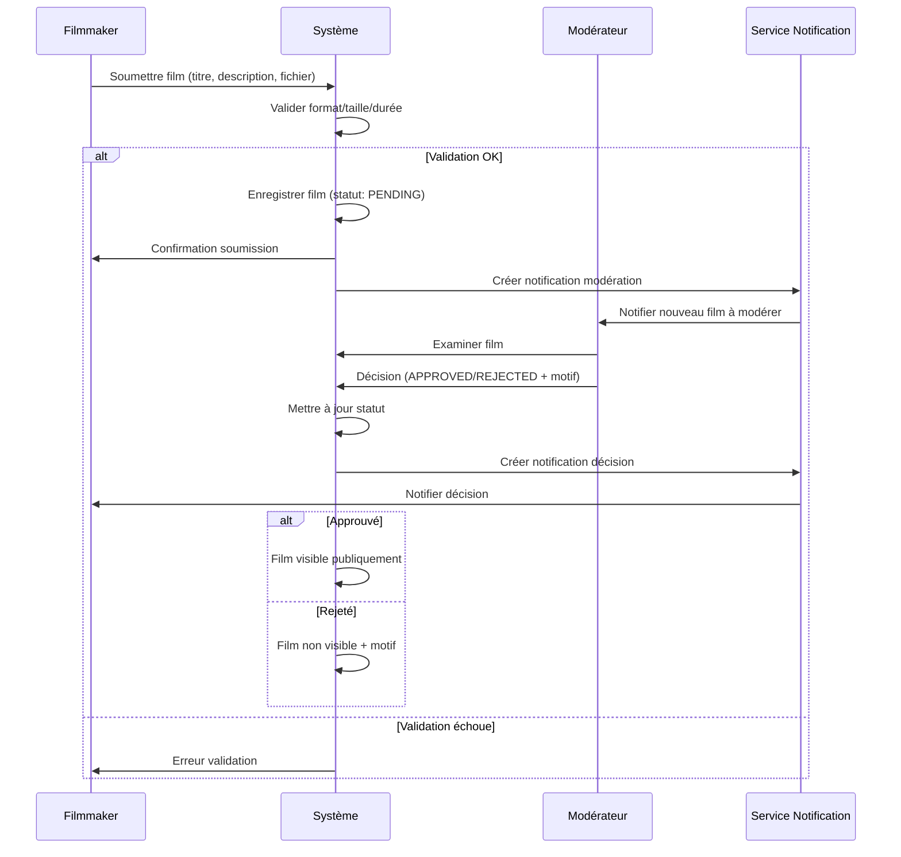

# Diagramme de Séquence - Soumission de Film

```mermaid
sequenceDiagram
    participant F as Filmmaker
    participant S as Système
    participant M as Modérateur
    participant N as Service Notification

    F->>S: Soumettre film (titre, description, fichier)
    S->>S: Valider format/taille/durée
    alt Validation OK
        S->>S: Enregistrer film (statut: PENDING)
        S->>F: Confirmation soumission
        S->>N: Créer notification modération
        N->>M: Notifier nouveau film à modérer
        
        M->>S: Examiner film
        M->>S: Décision (APPROVED/REJECTED + motif)
        S->>S: Mettre à jour statut
        S->>N: Créer notification décision
        N->>F: Notifier décision
        
        alt Approuvé
            S->>S: Film visible publiquement
        else Rejeté
            S->>S: Film non visible + motif
        end
    else Validation échoue
        S->>F: Erreur validation
    end
```
