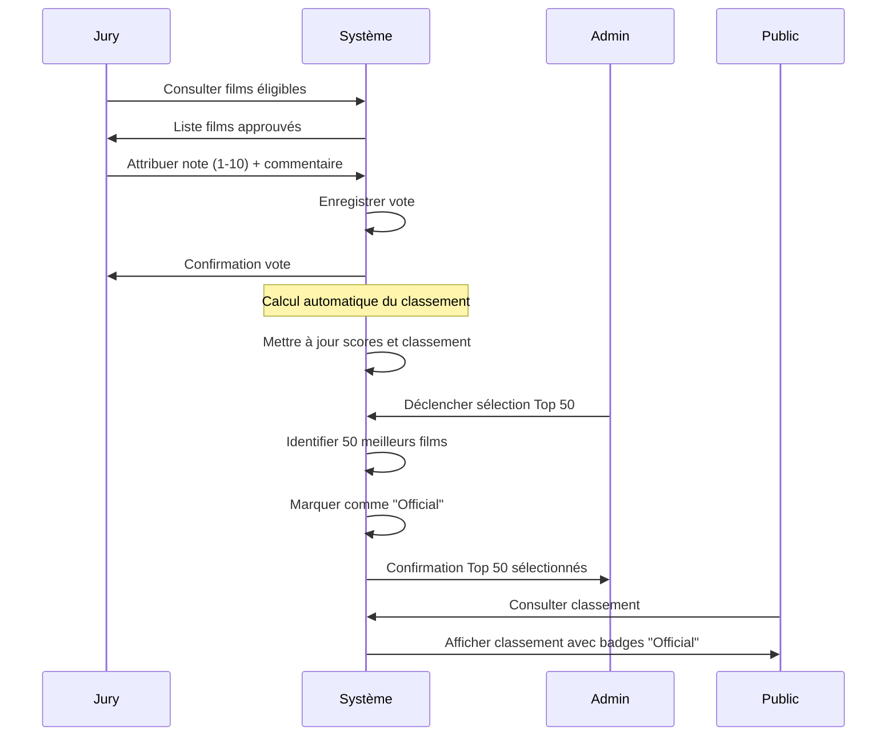

# Diagramme de Séquence - Processus de Vote

```mermaid
sequenceDiagram
    participant J as Jury
    participant S as Système
    participant A as Admin
    participant P as Public

    J->>S: Consulter films éligibles
    S->>J: Liste films approuvés
    J->>S: Attribuer note (1-10) + commentaire
    S->>S: Enregistrer vote
    S->>J: Confirmation vote
    
    Note over S: Calcul automatique du classement
    S->>S: Mettre à jour scores et classement
    
    A->>S: Déclencher sélection Top 50
    S->>S: Identifier 50 meilleurs films
    S->>S: Marquer comme "Official"
    S->>A: Confirmation Top 50 sélectionnés
    
    P->>S: Consulter classement
    S->>P: Afficher classement avec badges "Official"
```
